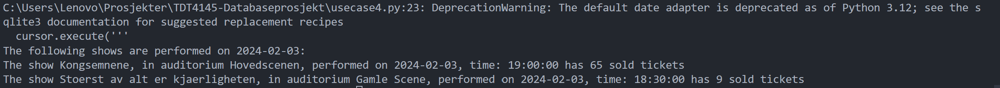
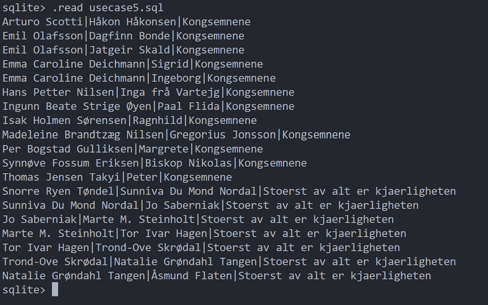

# TDT4145-Databaseprosjekt

Dette prosjektet er skrevet og gjennomført av Nora Ytterbø og Hanna Kongelf, våren 2024

---

Alt av antagelser, oppskrift for kjøring av program samt de tekstlige resultatene fra brukerhistorienes spørringer er vedlagt i denne README.md- filen.

## Endringer i SQL skjema:
Det er i utgangspunktet ikke noen større strukturelle endringer fra levering 1 til levering 2. Dette betyr at ER'diagrammet fortsattt gjelder, med unntak av endring eller fjerning av noen type attributter. Det er også gjort noen mindre endringer på SQL scriptet.
Oversikt over endring:
- Fjernet BillettklasseID fra Teaterstykke siden Billettpris refererer til TeaterstykkeID, trenger ikke være dobbelt
- Endret måten å kunnngjøre Primærnøkkelen i SQL scriptet
- Latt det være mulig å ikke registrere e-post på ansatte, da denne dataen ikke var tilgjengelig på nettsiden

## Oppskrift: _hvordan kjøre programmet_

Den tomme databasefilen til prosjektets SQLite-database heter [teater.sqlite](teater.sqlite).

Databaseappliksjonen har et tekstbasert brukergrensesnitt som kjøres i et terminalvindu. Kommandoene under er skrevet med utgangspunkt i en windows-terminal. Vennligst gjør eventuelle tilpasninger for MacOS- og Linux-baserte terminaler.

_Hvordan skrive i terminalen:_
I terminalen er det viktig at alt skrives ordrett inn slik som det står i oppskriften under. Hvis noe står inne i <>-tegn, skal man erstatte det inni med ønsket input på samme format, og IKKE ta med <>-tegnene. Det skal heller ikke tas med fnutter (""-tegn) noen steder.

_Dersom du skriver feil:_
Dersom du skulle skrive feil i terminalen, eller vil starte på nytt, kan du skrive `del teater.sqlite` i terminalen, og starte oppsettet på nytt.

### Oppsett og initialisering:

1. I terminalvinduet, etter å ha beveget deg inn i prosjektmappa, skriv følgende for å gå inn i databasefilen:

   `sqlite3 teater.sqlite`

   følgende bør nå dukke opp i terminalvinduet:

   

2. For å initialisere alle tabellene i databasefilen, skriv følgende:

   `.read initialisation.sql`

3. For å sette inn oppgitte data i databasefilen, skriv følgende:

   `.read input-data.sql`

4. Du skal nå exite ut av databasefilen. Skriv følgende:

   `.exit`

   Etter steg 2, 3 og 4 ser terminalen ut som dette:

   

5. For å sette inn seter i salene og opprette billetter for alle forestillinger, skriv følgende:

   `python add-seats-and-tickets.py`

   

6. For å lese inn og registrere forhåndskjøpte billetter, skriv følgende:

   `python scan-sold-seats-gamle-scene.py files-needed\gamle-scene.txt`

   `python scan-sold-seats-hovedscenen.py files-needed\hovedscenen.txt`

   

Nå er databaseapplikasjonen ferdig satt opp og initialisert, og vi kan utføre brukerhistoriene.

### Utførelse av brukerhistorier:

- For å kjøre brukerhistorie 3, kjøpe 9 voksenbilletter, skriv følgende:

  `python usecase3.py`

- For å kjøre brukerhistorie 4, forestillingsinfo for en spesifikk dato, skriv følgende:

  `python usecase4.py <YYYY-MM-DD>`

  Eksempel med datoen 3. februar 2024:

  _python usecase4.py 2024-02-03_

  Brukeren må skrive inn den ønskede datoen på DATE-formatet: YYYY-MM-DD . Hvis formatet ikke godtas av python-programmet får man følgende beskjed i terminalen:

  

- For å kjøre brukerhistorie 5, skuespillere som opptrer i teaterstykkene, skriv følgende:

  `sqlite3 usecase5.sql`

- For å kjøre brukerhistorie 6, hvilke forestillinger som har solgt best, skriv følgende:

  `sqlite3 usecase6.sql`

- For å kjøre brukerhistorie 7, hvilke skuespillere en oppgitt skuespiller har spilt i samme akt som, skriv følgende:

  `python usecase7.py <Name (Middlename) Surname>`

  eksempel med skuespilleren Arturo Scotti:

  _python usecase7.py Arturo Scotti_

  Merk at alle deler av navnet skal ha stor forbokstav.

## Tekstlige resultater fra spørringene over

- Brukerhistorie 3:

  "Kjøp 9 voksenbilletter til forestillingen for Størst av alt er
  kjærligheten 3. februar, hvor det er 9 ledige billetter og hvor stolene er på
  samme rad. Stolene trenger ikke være ved siden av hverandre. Vi ønsker å få
  summert hva det koster å kjøpe disse billettene."

  Billettkjøpet knyttes til dummy-kunden som ble lagt inn ved initialiseringen.

  

- Brukerhistorie 4:

  "Ta inn en dato og skriv ut hvilke forestillinger som finnes på denne datoen, og hvor mange billetter som er solgt til hver av disse. Ta også med forestillinger hvor det ikke er solgt noen billetter."
  
  _Obs! Her har vi glemt å skrive kommandoen vi skrev i bildet, som var:_ `python usecase4.py 2024-02-03`

  

- Brukerhistorie 5:

  "Hvilke skuespillere opptrer i de ulike teaterstykkene? Skriv ut navn på teaterstykke, navn på skuespiller og rolle."

  

- Brukerhistorie 6:

  "Hvilke forestillinger har solgt best? Skriv ut navn på forestilling og dato, og antall solgte plasser. Sorter i synkende rekkefølge etter antall plasser solgt."

  

- Brukerhistorie 7:

  "Lag et program som tar inn et skuespillernavn og finner hvilke skuespillere de har spilt med i samme akt. Skriv ut navn på begge skuespillerne og hvilket skuespill det skjedde."

  For en skuespiller i "Kongsemnene" ble resultatet følgende:

  

  For en skuespiller i "Størst av alt er kjærligheten" ble resultatet følgende:

  

  Hvis en skuespiller har spilt alene i en akt, eller ikke er en skuespiller skrives følgende melding ut:

  

## Ytterligere kommentarer; koden og tekstlige resultater

- I brukerhistorie 4 får vi i tillegg til forventet output en warning angående DATE-formatet. Den går ut på at default date formatet vi benytter avvikles fra Python versjon 3.12. Ettersom prosjektet har kort tidshorisont er det fortsatt brukbart i vårt tilfelle, men hvis dette skulle vært en langsiktig oppgave burde man sett på andre løsninger slik som beskjeden anbefaler.
